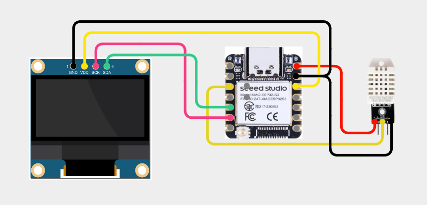

# XIAO-010-ThermoBlink-Monitor🌡️
Monitor temperature and humidity in style! This Thermo Blink Monitor uses the DHT22 sensor with the XIAO ESP32 S3 and an OLED display to show real-time climate data. When the temperature crosses a threshold, the display blinks — giving a visual alert that’s simple yet effective!

---

## 🛠️ Components Used

1. [XIAO ESP32 S3](https://robocraze.com/products/seeed-studio-xiao-esp32-s3-development-board-supports-wi-fi-bluetooth-5-0?_pos=1&_psq=XIAO+ESP32+S3&_ss=e&_v=1.0)
2. [DHT22 Temperature & Humidity Sensor Module](https://robocraze.com/products/dht22-humidity-and-temperature-sensor-module-am2302?_pos=1&_psq=dht22&_ss=e&_v=1.0)
3. [1.3" OLED Display (I2C)](https://robocraze.com/products/1-3in-oled-display?_pos=6&_psq=oled&_ss=e&_v=1.0)
4. [Breadboard](https://robocraze.com/products/breadboard?_pos=3&_psq=BREADBOARD&_ss=e&_v=1.0)
5. [Jumper Wires](https://robocraze.com/products/f2m-jumper-wires-20cm-40pcs?_pos=1&_psq=JUMPER+WIRES&_ss=e&_v=1.0)

---

## 🎥 Project Demo

📱 [Instagram Reel](https://www.instagram.com/reel/DRR8O_EExPb/?igsh=MmlheDVpMHp5MHB1)

---

## Circuit Diagram

---
